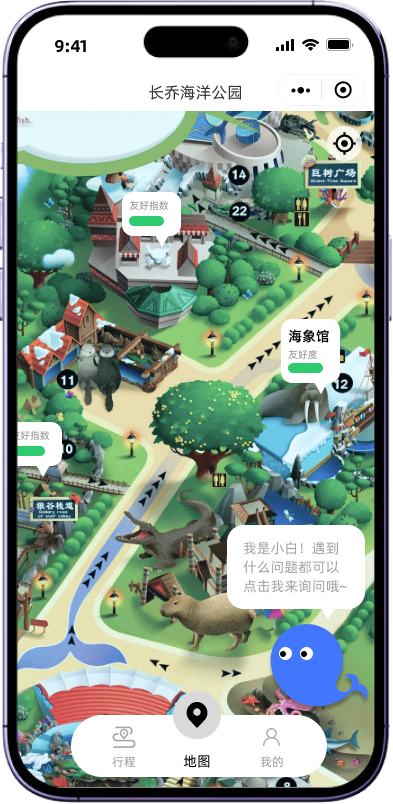
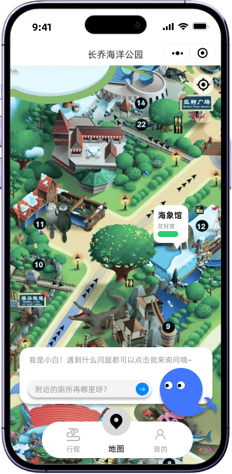
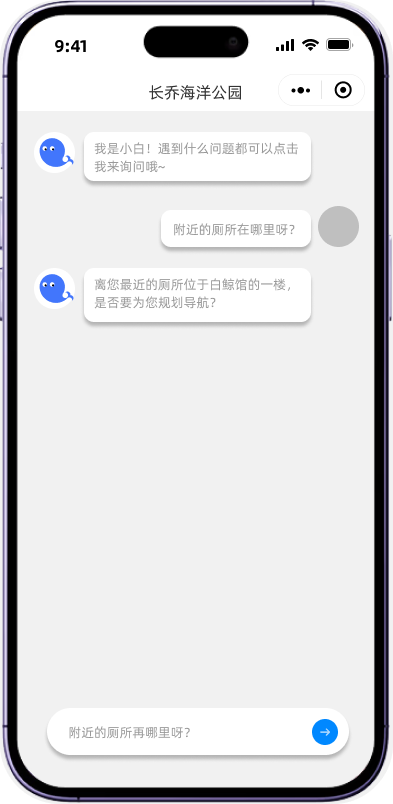

# 页面设计规范（保持布局不变的清晰友好优化）

  

## Global Styles（全局）
- **桌面优先的浏览器预览方式**：在 ≥ 1024px 宽度下，页面内容以“手机画布”居中展示（建议 375–430px 逻辑宽），左右留安全留白，避免拉伸导致布局变形。
- **背景**：页面大底色使用低反差暖色调（建议 #FAF8F5 或 #F7F9F9），避免纯白眩光；卡片/气泡可保持白色，但加轻微描边或柔和阴影增强分层。
- **字体与层级**：标题（园区名）> 点位名 > 正文提示 > 辅助信息（友好度）。保持字号差异明显但不突兀。
- **交互热区**：所有可点击元素 ≥ 44x44pt；图标按钮在不改变位置的前提下通过 padding 扩大热区。
- **图标+文字**：所有仅图标的按钮必须有“同位文字/辅助说明”（可用下方小字、长按提示、或无障碍 aria-label）。
- **动效**：禁止自动播放/闪烁；仅允许“温和、短时、可预测”的过渡（如 150–200ms 淡入淡出）。

## Page 1：地图页（默认态）
### Layout
- **布局方式**：整体为“顶部标题栏 + 全屏地图层 + 右侧控制按钮 + 底部 Tab”的叠层结构（绝对定位/层级管理）。
- **对齐与间距**：保持 Figma 位置不变；仅通过内边距补齐热区与可读性。

### Meta Information
- Title: 长乔海洋公园 - 地图
- Description: 园区地图与点位导览，支持快速提问。
- Open Graph: og:title/og:description 与 Title/Description 一致。

### Page Structure & Components
1. **顶部标题栏**
   - 标题居中。
   - 右侧功能按钮：不改变图标排列；补充“文字解释/无障碍标签”。
   - 状态：按下态使用轻微明度变化（避免强对比闪动）。
2. **地图层（手绘图）**
   - 地图不可因浏览器宽度拉伸变形：以固定宽手机画布展示，地图按比例缩放。
3. **点位卡片（含友好度）**
   - 保持卡片样式与位置；优化信息结构：
     - 主标题：点位名（如“海象馆”）。
     - 副信息：“友好度：高/中/低”与进度条并存（不改布局，仅补文字）。
     - 可点击态：提供柔和描边高亮，避免强烈跳动。
4. **助手入口（气泡+形象）**
   - 气泡文案更具体且可预测（不改变气泡位置）：例如“你可以问：厕所/入口/怎么走”。
   - 形象点击与气泡点击一致；避免出现只有装饰不可点的元素。
5. **底部 Tab**
   - 保持“行程/地图/我的”；当前高亮“地图”；每个 Tab 图标旁必须有文字（已具备）。

### Accessibility
- 重点元素支持键盘焦点（H5）：Tab 顺序从顶部到地图可交互点位，再到底部 Tab。
- 点位卡片为可读可聚焦元素：读屏文案建议“海象馆，友好度高，按钮”。

## Page 2：地图页（提问面板态）
### Layout
- **结构不变**：在地图底部叠加提问面板（类似底部轻量栏）。

### Sections & Components
1. **提问面板**
   - 输入框：默认填充示例问题（可一键清空后输入）。
   - 发送按钮：空输入禁用；禁用态仍可被理解（明度降低 + 文案/aria 提示“请输入问题后发送”）。
2. **与地图共存**
   - 面板不遮挡底部 Tab 的点击；若不可避免，需确保面板与 Tab 之间层级与点击区域互不冲突（以“可预测”为首要）。

### Interaction States
- 聚焦输入：面板保持稳定，不跳动；键盘弹起时，面板整体上移以露出发送按钮。

## Page 3：小白助手对话页
### Layout
- **布局方式**：顶部标题栏 + 中部消息流（可滚动）+ 底部输入栏（固定）。

### Meta Information
- Title: 长乔海洋公园 - 小白助手
- Description: 通过对话获得设施位置与下一步建议。

### Sections & Components
1. **消息流**
   - 气泡保持现有左右结构；优化可读性：行高略增、段落更清晰。
   - 助手回答避免一次性长段：建议分点（例如“位置/怎么走/下一步”）。
2. **输入栏**
   - 输入框与发送按钮热区足够；发送后输入框清空，并将焦点保持在输入框（方便连续提问）。
3. **返回**
   - 返回地图时保留上下文：至少保留最近一次问题与关联点位。

### Error & Loading（温和反馈）
- 加载：在消息流中以“助手正在思考…”的小气泡展示。
- 失败：以气泡提示“网络不稳定，请稍后重试”，提供同位“重试”文本按钮（不使用 Modal）。