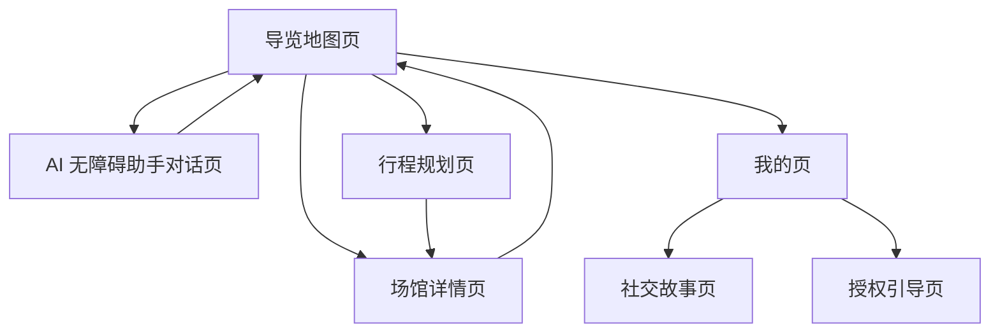

## 1. Product Overview
面向游客的“感官友好”海洋馆导览微信小程序：提供导览地图、AI 无障碍助手与行程规划。
目标：在微信小程序端稳定可用（可发布审核），交互可预测、低刺激、可访问。

## 2. Core Features

### 2.1 Feature Module
本次需求由以下页面构成：
1. **导览地图页**：手绘地图缩放/拖动、点位标记与选中态、地点卡片、地图控制按钮、助手入口、自定义 Tab。
2. **AI 无障碍助手对话页**：消息流、输入与发送、从地图带入初始问题、温和加载/失败提示。
3. **行程规划页**：地图背景、底部行程面板展开/收起、行程列表与编辑排序、跳转场馆详情。
4. **场馆详情页**：展示场馆基础信息、返回与状态保持。
5. **我的页**：入口聚合（社交故事/授权引导等）。
6. **社交故事页**：以卡片/章节形式展示社交故事内容。
7. **授权引导页**：解释授权原因、引导打开微信系统设置。

### 2.2 Page Details
| Page Name | Module Name | Feature description |
|---|---|---|
| 导览地图页 | 自定义导航栏 | 显示园区标题；避让微信“胶囊按钮”；右侧操作区保留图标并补充文字/无障碍说明。 |
| 导览地图页 | 地图交互 | 支持双指缩放与拖动；保持地图在可视范围内；进入/退出页面时记忆 x/y/scale。 |
| 导览地图页 | 点位标记与地点卡片 | 点击点位高亮；展示地点名称与描述；提供“查看详情/开始导航（占位）”。 |
| 导览地图页 | 助手入口与提问面板 | 点击小白展开输入；输入后跳转助手页并带入 initialQuery。 |
| 导览地图页 | 自定义 Tab | 提供“行程/地图/我的”切换；当前页高亮；点击切换使用 switchTab。 |
| AI 无障碍助手对话页 | 对话消息流 | 展示用户与助手消息；自动滚动到最新；加载/失败以气泡形式提示（不弹窗）。 |
| AI 无障碍助手对话页 | 输入与发送 | 支持键盘确认与按钮发送；空输入不可发送；发送后清空输入。 |
| 行程规划页 | 底部行程面板 | 支持拖拽展开/收起；展开态可滚动列表；收起态展示标题与关键信息。 |
| 行程规划页 | 行程列表 | 展示行程项卡片（图/标题/描述）；支持编辑模式下拖拽排序与删除；点击进入场馆详情。 |
| 场馆详情页 | 内容展示 | 根据路由参数展示标题/基础信息；提供返回。 |
| 我的页 | 功能入口 | 提供进入社交故事、授权引导等入口（与现有页面保持一致）。 |
| 社交故事页 | 内容阅读 | 按章节展示内容；保持低刺激排版与清晰层级。 |
| 授权引导页 | 授权说明与动作 | 解释为何需要位置等权限；提供“去设置/重新尝试”按钮。 |

## 3. Core Process
### 3.1 主要用户流程（游客）
1) 进入小程序默认落在【导览地图页】→ 缩放/拖动查看 → 点击点位查看地点卡片。
2) 在地图页点击“小白”→ 输入问题 → 进入【AI 无障碍助手对话页】继续追问 → 返回地图保持最近一次上下文。
3) 切换到【行程规划页】→ 查看推荐行程 → 进入编辑模式调整顺序/删除 → 点击某项进入【场馆详情页】。
4) 在【我的页】进入【社交故事页】阅读，或进入【授权引导页】完成必要权限设置。

### 3.2 微信小程序可部署：需重构点与兼容性约束（P0）
- 代码结构：将页面与组件从 Options API 统一重构为 Vue 3 `<script setup>` + Composition API（保证长期维护）。
- 交互事件：移除/隔离 H5 专用鼠标事件（如 mousemove/mousedown/hover），仅保留 touch 交互；必要时使用条件编译 `#ifdef H5`。
- 样式兼容：禁用/降级小程序不稳定的 CSS（如 `backdrop-filter`、滚动条伪类、hover 样式、cursor）。
- 安全区与胶囊：所有 `navigationStyle: custom` 页面必须按 `getMenuButtonBoundingClientRect()` 计算标题栏高度与右侧操作区安全间距。
- 自定义 TabBar：当 `pages.json.tabBar.custom=true` 时，需按微信自定义 tabBar 规范落地（目录与渲染方式匹配），避免“页面内自绘 tabbar + 系统 tabbar 配置”冲突。
- 资源兼容：校验 SVG 在 mp-weixin `<image>` 的支持情况；不支持时改为 PNG 或 `uni-icons`。

### 3.3 部署/发布流程（mp-weixin）
1) 配置 `src/manifest.json` 的 `mp-weixin.appid`（以及项目 `appid`）。
2) 本地构建：`npm i` → `npm run build:mp-weixin`（或开发态 `npm run dev:mp-weixin`）。
3) 微信开发者工具导入构建产物目录，完成真机预览与体验版上传。
4) 按微信规范补齐隐私合规（权限用途说明等），提交审核并发布。

