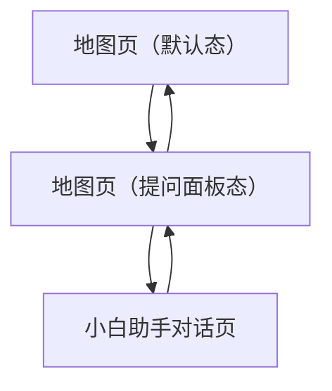

## 1. Product Overview

面向游客的园区地图与“⼩⽩”问答助手：你可以在地图上找点位、并用自然语言快速问路/问设施。
目标：在不改变现有布局的前提下，让信息更清晰、交互更可预测、更友好（含无障碍与自闭症友好）。

  

## 2. Core Features

### 2.1 Feature Module

本次需求由以下页面/状态构成：

1. **地图页（默认态）**：园区手绘地图、点位标记（含“友好度”）、地图控制按钮、底部 Tab、助手入口。
2. **地图页（提问面板态）**：在地图上方展开轻量提问面板（不遮挡关键导航区域）、支持一键发送。
3. **小白助手对话页**：消息流展示、输入框与发送、基于当前点位/位置给出答案与下一步建议。

补充：地图页支持**双指缩放**与**拖动**；点击地点可**高亮**并在底部滑出地点卡片（地点数据本期先不接入，仅保留交互与承载结构）。

### 2.2 Page Details

| Page Name  | Module Name | Feature description                                        |
| ---------- | ----------- | ---------------------------------------------------------- |
| 地图页（默认态）   | 顶部标题栏       | 显示园区名称；右侧图标保留但补齐文字/无障碍标签（用于“更多/定位/设置”等语义化说明）。              |
| 地图页（默认态）   | 地图与点位标记     | 展示手绘地图；支持缩放/拖动；点位可点击高亮并弹出底部地点卡片；地点卡片可继续触发提问面板/导航（本期导航仅占位）。 |
| 地图页（默认态）   | 助手入口（气泡+形象） | 展示“我可以帮你…”的稳定提示文案；点击后进入“提问面板态”；不自动弹出、不闪烁。                  |
| 地图页（默认态）   | 底部 Tab      | 显示“行程/地图/我的”；当前态高亮“地图”；点击仅切换（本期仅定义地图相关，不扩展其它页细节）。          |
| 地图页（提问面板态） | 提问面板（底部展开）  | 提供单行输入与“发送”按钮；默认给出示例问题（可编辑）；点击发送进入“对话页”并自动带入该问题。           |
| 小白助手对话页    | 消息流         | 展示用户提问与助手回答；回答可包含“下一步建议”（例如：提示最近设施位置、是否回到地图查看）。            |
| 小白助手对话页    | 输入与发送       | 支持继续追问；发送后将问题追加到消息流；在网络慢时显示温和的加载态（非弹窗）。                    |
| 小白助手对话页    | 返回与状态保持     | 返回地图时保留你刚才的点位上下文/提问内容（至少保留最近一次）。                           |

### 2.3 开发计划（分期）

* P0（本期）

  * 地图缩放/拖动

  * 地点点击高亮 + 底部地点卡片（可关闭）

  * 地点卡片动作按钮占位（不接真实导航/详情）

* P1（后续）

  * 接入地点数据（id、名称、类型、坐标、友好度等）

  * 真实导航（路径规划、无障碍路径优先等）

  * 地图筛选/搜索与推荐

## 3. Core Process

### 3.1 三页面跳转与交互（保持布局不变的优化建议）

* 地图页（默认态） → 地图页（提问面板态）

  * 触发：点击“⼩⽩形象/提示气泡”或点击某个点位卡片。

  * 优化（不改布局）：

    * 把图标补齐可读文字（或长按/悬停提示）与无障碍标签，避免“只靠图标猜”。

    * “友好度”增加可理解的文字等级（如“友好度：高/中/低”）并保持原进度条位置不变。

    * 提示文案更具体、可预测：从“遇到什么问题都可以…”改为“你可以问：厕所/入口/表演时间/怎么走”。

* 地图页（提问面板态） → 小白助手对话页

  * 触发：点击发送按钮。

  * 规则：将输入内容作为一条“用户消息”带入对话页首屏；若当前有点位上下文，则在对话页回答中优先引用该点位（例如“海象馆附近…”）。

  * 优化（不改布局）：发送按钮提供 3 态：默认/按下/不可用（空输入时不可用，颜色降低对比但仍可辨）。

* 小白助手对话页 → 地图页（默认态/提问面板态）

  * 触发：系统返回/导航返回。

  * 规则：

    * 若你是从“提问面板态”进入对话页，返回时回到“提问面板态”（便于继续改问句）。

    * 若你是从地图默认态直接进入（后续扩展场景），则返回默认态。

### 3.2 浏览器预览验收标准（用于 H5/桌面浏览器验收）

1. **布局一致性（不改布局）**：

   * 页面结构与元素相对位置与 Figma 保持一致（允许字体渲染导致的 ±2px 视觉差异）。

   * 地图页：顶部标题栏、右侧按钮组、点位卡片、底部 Tab、助手入口位置不改变。
2. **无干扰与可预测**：

   * 无任何自动播放动画、自动弹窗、闪烁提示；所有提示由你主动触发。
3. **可点击热区**：

   * 所有图标按钮、点位卡片、Tab、发送按钮点击区域 ≥ 44x44pt（H5 用等效像素实现）。
4. **可读性与低刺激**：

   * 避免纯白大面积背景：对话页背景使用偏暖浅灰（如 #FAF8F5 / #F7F9F9）以降低眩光；气泡仍可保持白色但加轻微阴影/描边（不改布局，仅调样式）。

   * 文字对比度达到 WCAG AA（正文建议 ≥ 4.5:1）。
5. **输入与键盘**：

   * H5 中聚焦输入框不会遮挡发送按钮；页面自动滚动到可见区域；发送后输入框清空（可撤销：支持“撤回输入”可选）。
6. **状态保持**：

   * 从对话页返回地图后，最近一次提问与点位上下文仍可用（至少在本次会话内）。
7. **错误与弱网**：

   * 请求失败时以消息气泡形式提示“未连接/请稍后再试”，不使用 Modal；可重试。

