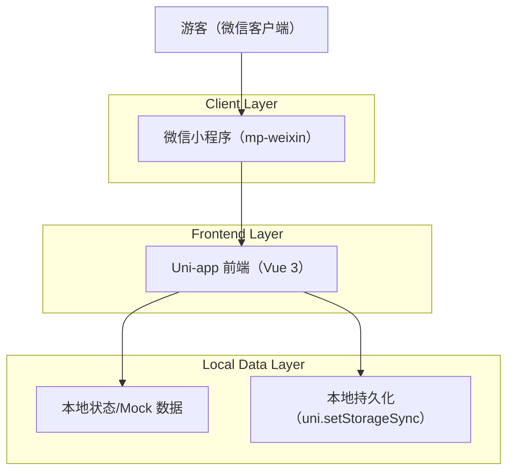

## 1.Architecture design

## 2.Technology Description
- Frontend: Uni-app（@dcloudio/uni-app）+ Vue@3 + Vite + Sass
- UI: uni-ui（uni-icons 等）+ 自定义组件（自定义导航栏/TabBar/底部面板）
- Backend: None（当前仅交互与本地 mock；若后续接入大模型/地图服务，建议新增服务端以安全保存密钥）

## 3.Route definitions
| Route | Purpose |
|---|---|
| /pages/map/index | 导览地图页（地图交互、点位与助手入口） |
| /pages/assistant/index | AI 无障碍助手对话页 |
| /pages/planner/index | 行程规划页（底部面板与行程编辑） |
| /pages/venue-detail/index | 场馆详情页 |
| /pages/profile/index | 我的页 |
| /pages/social-story/index | 社交故事页 |
| /pages/permission-guide/index | 授权引导页 |

## 4.微信小程序兼容性约束（必须遵守）
- 运行环境：业务逻辑禁止使用 BOM/DOM（window/document/localStorage）；统一使用 `uni.*` API。
- 事件模型：小程序端无鼠标事件；涉及 mousemove/mousedown/hover 的交互需移除或用条件编译隔离。
- 样式能力差异：避免依赖 `backdrop-filter`、滚动条伪类、hover、cursor 等；过渡动效仅在用户触发时短时使用。
- 安全区：底部适配 `safe-area-inset-bottom` 需提供降级方案；顶部自定义导航栏必须避让微信胶囊按钮。
- 资源：静态资源必须位于 `src/static`；校验 SVG 在 `<image>` 的支持，不可用则替换 PNG 或 `uni-icons`。

## 5.需重构点（按上线优先级）
1) **自定义 TabBar 落地**：当前 `pages.json.tabBar.custom=true`，但项目内为“页面内组件式 tabbar”。需二选一：
   - 方案 A（推荐，贴合微信）：按 uni-app/微信自定义 tabBar 规范提供 `src/custom-tab-bar/`，并让页面不再重复渲染 tabbar；
   - 方案 B（实现快）：关闭 `tabBar.custom`，使用系统 tabbar（放弃浮层胶囊样式）。
2) **统一 Vue 3 写法**：页面/组件从 Options API 迁移至 `<script setup>`，减少跨端差异与维护成本。
3) **移除 H5 专用交互**：如 `planner` 页的鼠标拖拽逻辑；统一 touch 拖拽，H5 仅作为调试预览可选增强。
4) **样式兼容治理**：对 `backdrop-filter`、`100vh`、scrollbar 相关 CSS、过长 transition 做降级；单位优先 `rpx`。
5) **导航栏安全区**：所有 `navigationStyle: custom` 页面按胶囊位置计算：状态栏高度 + 胶囊高度 + 右侧留白。

## 6.部署步骤（mp-weixin，可在团队内复用）
1) 准备环境：安装 Node.js（与团队统一版本）、微信开发者工具。
2) 填写 AppID：在 `src/manifest.json` 配置 `mp-weixin.appid`。
3) 安装依赖：`npm i`。
4) 开发调试：`npm run dev:mp-weixin`，用微信开发者工具导入 `dist/dev/mp-weixin`。
5) 构建发布：`npm run build:mp-weixin`，导入 `dist/build/mp-weixin`，上传体验版/提交审核。
6) 合规检查：在“授权引导页”与小程序隐私协议中说明权限用途，避免审核卡点。
