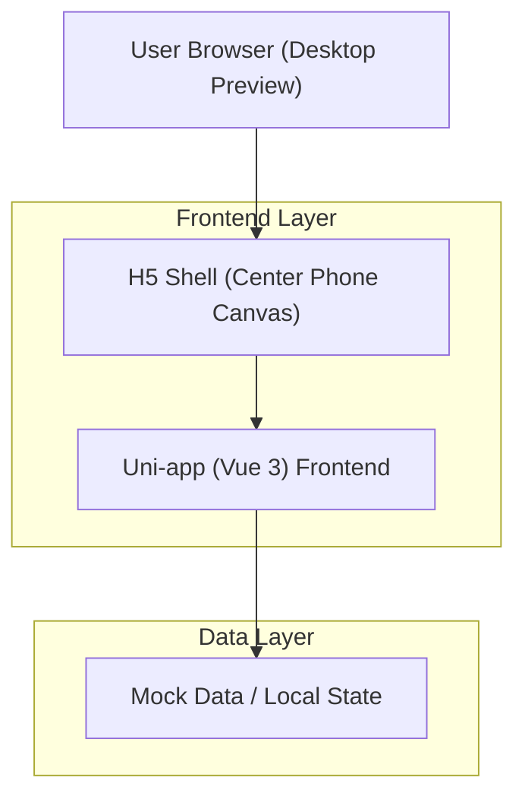

## 1.Architecture design

## 2.Technology Description
- Frontend: Uni-app + Vue 3 (Composition API, script setup)
- UI: uni-ui（如 uni-icons） + 自定义样式（低刺激配色、可访问焦点态）
- Backend: None（本期仅交互与验收；助手回复可先用本地 mock，后续再接入真实服务）

## 3.Route definitions
| Route | Purpose |
|-------|---------|
| / | 重定向到地图页 |
| /map | 地图页（包含默认态与提问面板态两种 UI 状态） |
| /assistant | 小白助手对话页（消息流与输入发送） |

## 4.API definitions (If it includes backend services)
本期不包含后端服务与 API。若后续需要接入大模型（需安全保存 Token），建议新增服务端并将第三方 API Key 仅保存在服务端环境变量中。